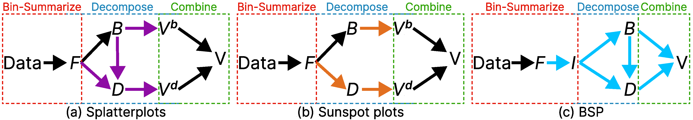

### Results

 The scatterplot suffers from overdrawing; overlapping visual marks obscure the major structures.  (b) A density plot using a Gaussian kernel reveals the global patterns, but the high density in the center (\ie Manhattan) hides peripheral local structures in the blue box, while outliers in the red box are missed.  (c) The Sunspot plot better preserves the outliers but cannot reveal local density variations; see,~\eg the blue box.  (d) Splatterplots abstract the density variations in high-density regions, hiding local structures, but show point samples in low-density regions; see the red box.  (e) Our Bi-Scale density Plot (BSP) provides more details in low-density regions and reveals more underlying structures; and (f) The BSP enriched by our default 2D colormap, additionally allows looking up and comparing absolute density values and local density variations.")

.  Finally, we magnify the detail layer and incorporate it into the base layer to produce the bi-scale density plot (BSP) to better reveal the outliers (see the ones in the red box).")

 The table shows how five experimental tasks correspond to the abstract tasks and design requirements. (b-f) The results of the controlled study, where we show the confidence interval plots and statistical tables for the tasks. Error bars represent 95\% confidence intervals. Each table shows the statistical test results of our experimental methods, showing the mean with 95\% confidence interval and p-value from the Mann-Whitney test with two target methods (BSP-VF-1D and BSP-VF-2D).")

 Our BSP plot generated  by the original bivariate colormap (b); and (c) improved BSP that shows more structures generated by adjusting the bivariate colormap with more hue in the value range [100,400] (d).")

### Supplementary Material
The full evaluation results, user study website, and the analysis code are available at [OSF](https://osf.io/7qbhe/?view_only=ffe2ab92df354c43b984953e42ce3af0).