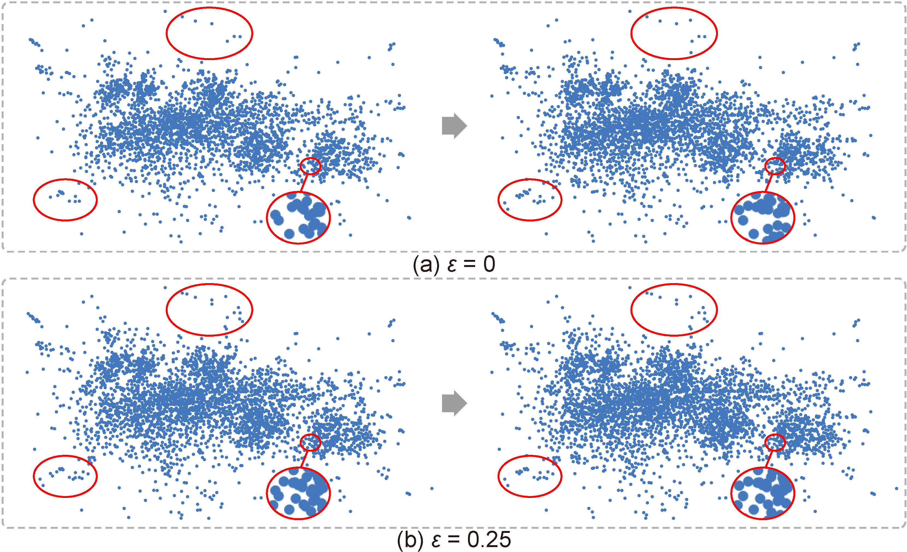

### Results

. The orange dashed boxes and red dashed circles represent typical low- and medium-density regions, respectively. (a,b,c) A large λ results in more regions classified as low-density regions; (d,b,e) a large ω results in more display samples in low-density regions; (f) when λ and ω are both large, almost all low-density regions in the original scatterplot are kept but the data density ratios cannot be maintained; (b,g,h) decreasing stopLevel introduces more display samples; outliers in low-density regions can be shown more clearly but overplotting will have resulted.")

 These violin plots summarize the values of PDDr (a) and ESRr (b) over all the tested datasets, where a larger PDDr score is better and a smaller ESRr score is better; (c) the violin plot shows the log-scale computational times of three most efficient methods with C++ implementations tested over all the datasets; and (d) the curves show the relationship between the execution time (running the sampling procedure) and the data size of different methods by using synthetic datasets.")

 PDDr (c,d), and ESRr (e,f) evolve over iterations for loading the two tested datasets (activity and census) for sampling by the three methods being compared: static and progressive versions of our method vs. reservoir sampling. Our progressive method is the most stable and makes a good balance between preserving relative data densities and outliers.")

 the scatterplot of the input data (top) and the density map (bottom); (b,c) the results of the intermediate frames generated by reservoir sampling (b) and our method (c).")

 and stock percentage change (vertical) for two different time ranges: before the Sep. 11 attacks (left column) and the whole Sep. 2001 (right column). (a,b) the overplotted scatterplots of the original data; and (c,d) streaming visualization results of our method from (a,b), showing that our method can produce faithful visualizations.")

### Supplementary Material
The supplemental material file is available at <http://www.yunhaiwang.net/Vis2021/progressive-sampling/supp.pdf>.