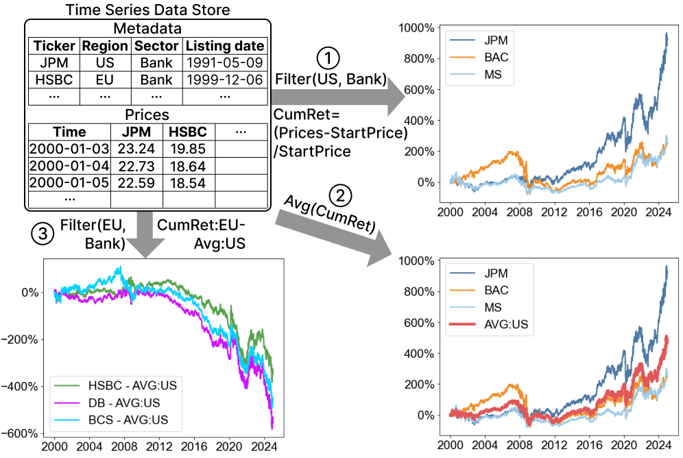

### Results

. (b) The corresponding line charts with two pixel columns: the blue line connects all data points, while the black line uses only M4-aggregated samples in each pixel column. (c) The corresponding TAT structure, where each node stores the minimum and maximum values and the associated time interval.")

 monotonic univariate, (b) non-monotonic univariate, and (c) bivariate. In all cases, the input time series has values {7, 8, 10, 6}, represented by black dots within a single pixel column. The corresponding function values are shown as black squares, while yellow and green squares mark the minimum and maximum function values within the domain, respectively. In (c), an additional time series {4, -3, 0, 1} is used, and the corresponding TAT structures are illustrated in (d).")

 For the non-monotonic function f(x) = (x2 - 1) / 2, Q retrieves aggregated values from the TAT, with node scores shown below. (b) Evolution of candidate lists α and 𝛽 over the query process, alongside corresponding progressive visualizations. The ground truth f(X), shown in gray, is for reference only; it is not computed during execution.")

 The four extreme rasterization cases and (e) our average estimation approach using α and 𝛽 values obtained in the first iteration. Red and blue boxes indicate erroneous pixels relative to the final visualization in Figure 5 (b) and consistently rasterized pixels across all four cases, respectively. Black dashed lines serve as virtual guides for rasterization between Rk that do not correspond to valid results.")

 SSIM, (b) response time, and (c) memory usage.")

 and memory usage (b,d) of the three systems under varying (a,b) numbers of data points and (c,d) numbers of input variables when applying the transformation L2ln(X) to the synthesized time-series datasets.")

 SSIM scores and (b) response time.")

 The boxplots summarize the SSIM scores across all datasets. (b) The dot plot shows the relationship between pixel error rate upper bound ε and the actual pixel rate 𝜁 on the <i>Power</i> dataset. (c) The dot plot displays the mean SSIM scores for various configurations with a fixed 𝜏 = 5%.")

 and synthetic dataset <i>Syn5B</i> (c, d): (a, c) SSIM scores; (b, d) response times.")

### Supplementary Material
The supplemental material file is available at <https://www.yunhaiwang.net/sigmod2026/PIVOT/supp.pdf>.