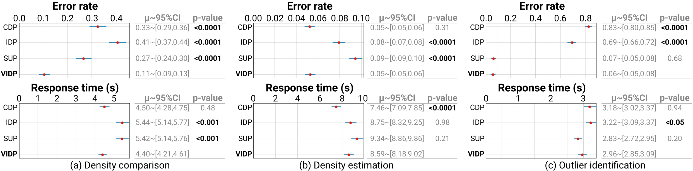

### Results

 Increasing η makes low-density structures more salient while the high-density structures remain unchanged. (e,f,c,g,h) Decreasing φ makes low-density structures clearer, but at the same time darkens high-density structures.")

 produced by four experimental techniques on ten datasets. Dash lines indicate the average DCD of their corresponding techniques. For values out of the plot range, we treat them as outliers and draw a dark halo to indicate them.")

 The replicated results of CDP and SUP variants without shading and with Phong shading and ambient occlusion (AO), respectively, as presented in Trautner et al. [4]. (d) The VIDP result with default parameters. According to Equation 8, the degree of color distortion of (b,c,d) are 4.09, 2.24, and 1.27, respectively.")

 A small local η =0.2 can suppress minor structures in the area above London (the blue box in (b)), and a large local η =20 can reinforce minor structures in the northwest area of Scotland (the red box in (b)).")

### Supplementary Material
The online demo is hosted on <https://xinchen-sdu.github.io/Visualization-Aware-Illumination-for-Density-Plots/>.

The full evaluation results, user study website, and the analysis code are available at [OSF](https://osf.io/5xpsw/?view_only=0445046dad574d4a90d7138e94547ada).