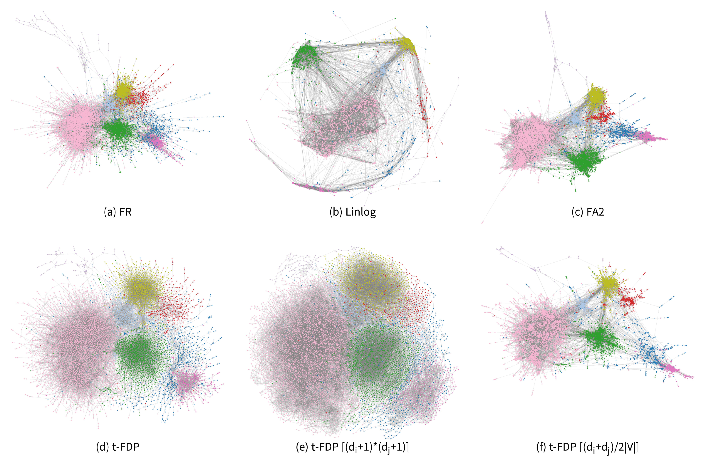
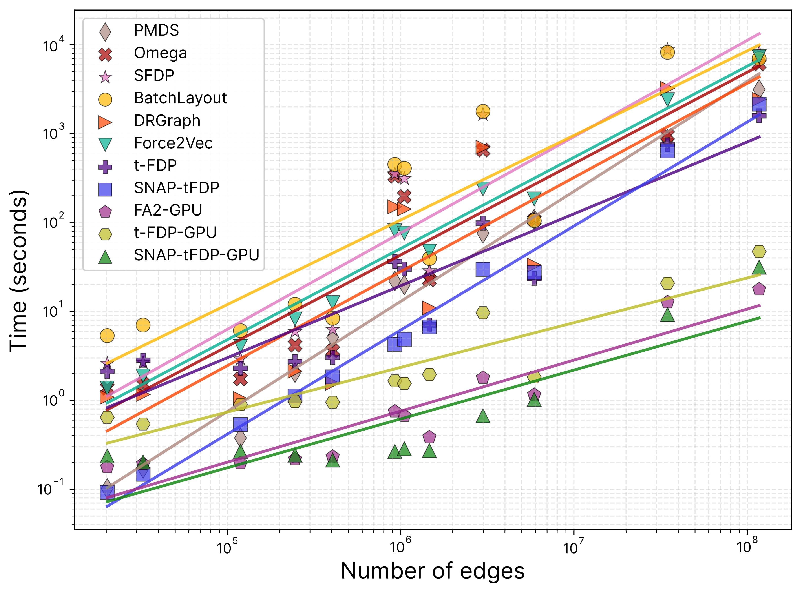
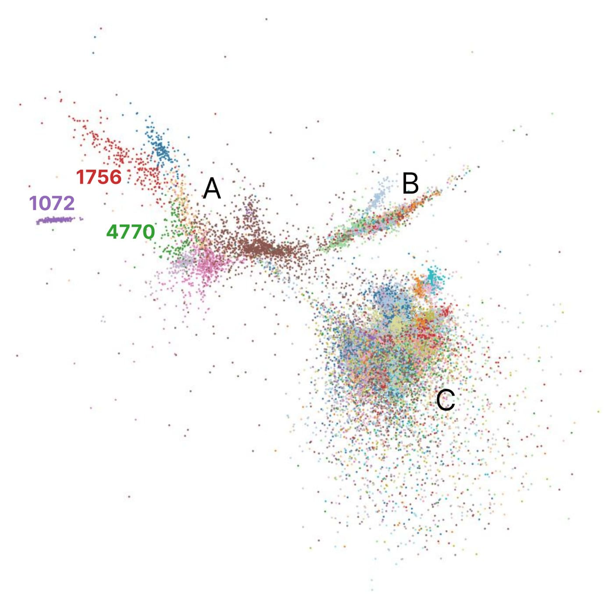

### Results

 two high-degree nodes and (b) a high-degree node and a low-degree node. The attractive force Fat-FDP is identical in all cases and is shown as a black solid line. Product-based weighting (orange) produces overly strong relative repulsion and its normalized variant (purple) nearly eliminates repulsion for low-degree nodes, while linearly normalized degree weighting (red) provides effective balance.")

 Energy loss curves showing that the actual energy of SNAP-tFDP converges consistently with the effective energy. (b) Superimposition of layouts by SNAP-tFDP (colored) and the full computation (gray).")

 Layout results and corresponding runtime of the serial SNAP-tFDP algorithm for different k on the APH dataset. (b) NP, SI, and CQ scores under varying k. Results for individual datasets are shown in gray, with the average across datasets highlighted in red.")

 Convergence of the silhouette index (SI) for the serial SNAP-tFDP algorithm and its two lock-free parallel variants on the largest com-lj graph, where semi-transparent points indicate the results of five independent runs. (b) Layouts at four different epochs; for clarity, only the top 20 largest communities are shown.")

, SI (b), and CQ (c) for layouts generated by nine methods across all datasets. Empty cells indicate that the graph was too large to be processed by the corresponding method. Each row corresponds to a dataset, and each column to a layout method. Colors are scaled row-wise based on the best and worst within each dataset.")

 combines degree weighting with t-forces, yielding clear cluster structures with the lowest runtime, as fast as pure Pivot MDS.")

 Differences in visual quality scores between the two parallel variants and the serial SNAP-tFDP across all datasets. (b) Speedup comparison of SNAP-tFDP and the parallel implementations of existing methods as a function of the number of CPU threads on the largest com-lj dataset.")

### Supplementary Material
The supplemental material file is available at <https://www.yunhaiwang.net/vis2026/SNAP-tFDP/files/supp-snap-tfdp.pdf>.

### Acknowledgements

The authors like to thank the anonymous reviewers for their valuable input. This work is supported by the grants of the NSFC (No.62402284, No.6260072651, No.U2436209), the Beijing Natural Science Foundation (L247027), NSF of Shandong province (ZR2024QF212), the Liaoning Revitalization Talents Program (No. XLYCE2504024), Liaoning Provincial Doctoral Start-up Research Fund (No. 2026-BS-0096), the Fundamental Research Funds for the Central Universities, and the Research Funds of Renmin University of China.