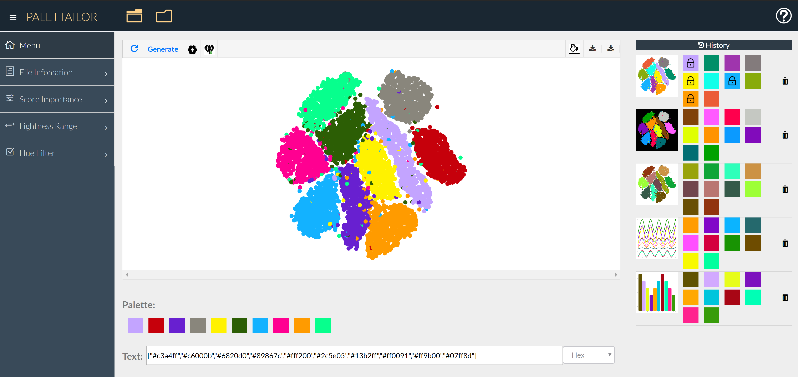

### Results

 Results generated by a KNN graph using only point distinctness: the generated colors are hard to discriminate; (b) Nearest neighbors of the selected point in the KNN graph; (c) Results generated by α-Shape graph only using point distinctness: the generated colors are easily to discriminate; (d) Nearest neighbors of the selected point in the α-Shape graph.")

 without Class Discrimination constraint; (b) without considering background color making it hard to see points of one class; (c) integrating the white background into the optimization lets the class appear in a dark color; (d) integrating the black background color into the optimization changes the colorization of many classes in order to create the necessary contrast.")

 each curve in a line chart is discretized into equidistant points; (b) colorized line chart; (c) for a bar chart, the center of each bar is represented as a point and connected to its two adjacent bars for forming the graph; (d) colorized bar chart.")

. For example, Colorgorical’s process involves automatic color palette generation and manual color assignment, meaning that it needs manual effort to assign the colors from the palette to the visualization.")

, we give a confidence interval plot and a statistic table. In the table, for each condition we provide the statistics including the mean with 95% confidence intedrval (μ ~95%CI), the W-value and p-value from the Mann-Whitney test, and the effect size (d ~95%CI). For the discrimination tasks on the left, we conducted statistical tests to compare Palettailor to every other condition, and provide W or V values, p-value and effect size (d ~95%CI) accordingly in the tables.")

 Palette generated by default setting; (b) User-specified Hue Filter with “green” and “blue”; (c) After clicking on colors to lock them, our system completes the palette automatically.")

### Supplementary Material
The supplemental material file is available at <https://www.yunhaiwang.net/infoVis2020/palettailor/pdf/vis20a-sub1326-i7.pdf>.